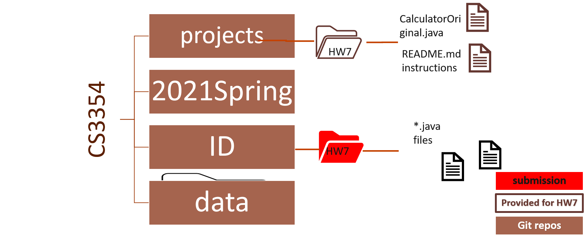

# Graphical user Interface Improvement

Due date on Canvas

## Goal: 
The goal of this assignment is to help students familiarize with Java Swing framework 

This homework can be done either individually or with a team. 
* If you are working with a partner, upload it to one repository, note both authors

## Submission 

This homework can be done either individually or with a partner. If you are working with a partner, submit one version to https://git.txstate.edu/CS3354/<ID> repository and specify both names in the submitted java files under @author tag

•	Submission folder   -> HW7 folder
•	Submission file: CalculatorDemo.java 
•	Submission file with timestamps before due date 

* Navigate to your class project central
```
cd CS3354
```
* Get the <ID>, projects, and data folder. <ID> is your team or individual project directory. 

  * Option 1: get them for the first time
  ```
   cd CS3354
   git clone https://git.txstate.edu/CS3354/<ID>.git
   git clone https://git.txstate.edu/CS3354/projects.git
   ```
  * Option 2: update the codebase 
  
   ```
   cd <ID>
   git pull
   cd ../projects
   git pull
   cd ..    
   ```
* Copy HW7 from projects folder to <ID> folder 
   ```
   cp -r projects/HW7/ <ID>

   ```
  
* Make changes as instructed below and push to repository 
   ```
   cd CS3354/<ID>
   git add HW7/*.*
   git commit -m "HW7 code update comment here"
   gitk
   ```
   * gitk will show you the status, **close** it to continue
   ```
   git push origin master
   ```
 
 
 
# Tasks 

1. 40 pt CalculatorOriginal.java code is provided as a baseline. Copy it to CalculatorDemo.java, and change the original implementation by implementing ActionListeners in a different way than provided. 
 * Approach 1: create one or more ButtonListener classes that implements ActionListener and based on what is selected define action. 
 * Approach 2: define separate anonymous class when each ActionListener is needed - https://docs.oracle.com/javase/tutorial/java/javaOO/anonymousclasses.html
 
Examples in [m4](https://git.txstate.edu/CS3354/2021Spring/tree/master/m4/src/main/java) provide four different implementation approaches.  Pick one approach and edit CalculatorDemo.java accordingly.  There will be **no credit** if 
* there is no new CalculatorDemo.java class in your submission
* the implementation is left as is
 
2.  30 pt Extend the functionality of edited CalculatorDemo.java: 
* add 1/x, x^2 (x square), and sqrt(x) (square root of x) buttons
* implement these three functionalities so they are interactive like existing ones.

3. 20 pt Change the button layout and size of the calculator so the functionality addition of 3 buttons looks native and more compact. 
* Re-factor the methods in CalculatorDemo.java 
  * namely CalculatorDemo constructor and make more compact logical units.  
* Group related statements into methods.  
  * You can add additional classes (e.g. CalculatorMain) to separate computation from GUI and instantiation and main.  
*See eprovided examples under [m4](https://git.txstate.edu/CS3354/2021Spring/tree/master/m4/src/main/java) folders 

4. 10 pt Add javadoc to CalculatorDemo.java (and to any java files you might have added) to document the methods. 

## Answers
1. There is no single correct solution. If you are unsure about certain decisions and need to make assumptions, please state your assumptions clearly in your solution document. 
2. You can chose how to compile and run .java files to insure correctness of the solution.  All is required for HW7 is submission of 2 *.java files under HW7 folder 
