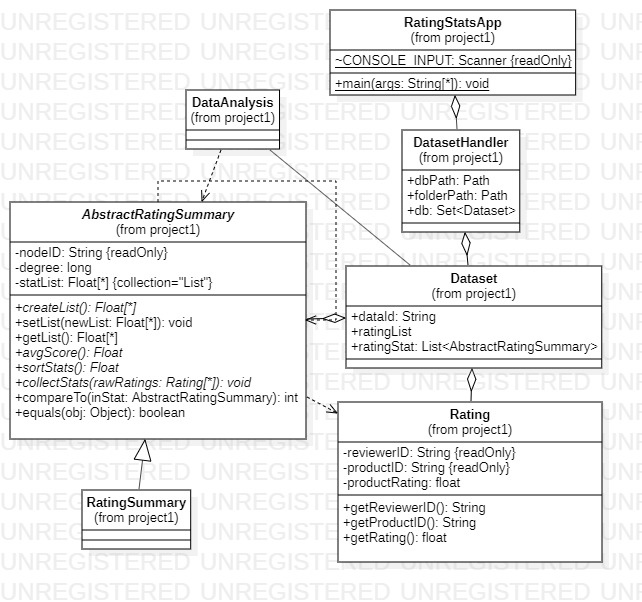

# Amazon Review Exploratory Data Analysis
* Due date on Canvas 

In your first CS 3354 programming assignment, you will implement methods to support exploratory data analysis module for the rating analysisof various rating summaries. We are using a real example of ratings from Amazon [data], (http://jmcauley.ucsd.edu/data/amazon/links.html), and  have provided Amazon Instant Video and Music files as examples in data folder. 

Students are expected to add methods and javadoc to the following 4 Java classes: Dataset, DatasetHandler, DataAnalysis, and RatingSummary, as outlined in project description and grading [RUBRIC](RUBRIC.md) document. **DO NOT EDIT ** Rating, AbstractRatingSummary, and RatingStatsApp classes.

## Data Folder

The project simulated database by marking a set location for the data file, and data.csv. **Location** of the [data](https://git.txstate.edu/CS3354/data) repository.

We will refer to it as **data** folder in the project.  This is a **default** data location. You can hard code the relative path w.r.t. projects folder. 
* If your program does not find it, add an option for the user to enter it in the commandline. 
* Checked folder contains raw files only.
* You will save output .csv files and data.csv file in the **DATA** folder.

## data.csv

**data.csv** is in **data** folder (simulating database file) and it contains the provided filenames, number of reviews, and datase Id string identifiers, used for output summary filenames. If it is not there, your code should create it. 

```
dataID,NUMBER,RATINGS,STATS
SMALL,2,small.csv,ratingSummary_SMALL.csv
TEST,5,test.csv,ratingSummary_TEST.csv
VIDEO,583,933,Instant_Video.csv,ratingSummary_VIDEO.csv
MUSIC,836,006,Digital_Music.csv,ratingSummary_MUSIC.csv
```

### Input Raw File Format

* name - specified in data.csv or by the user
* format - every lines in .csv file corresponds to: 
```
ReviewerID,ProductID,ReviewScore
```
  * ReviewerID - starts with A
  * ProductID - starts with B
  * ReviewerScore - integer number on scale from 1 to 5

### Input Stat File Format
* name - ratingSummary_<DATA_ID>.csv - corresponds to the name in data.csv file entry, DATA_ID column. 
* format - every lines in .csv file corresponds to: 
```
Id,degree,product avg,reviewer avg,
A00625243BI8W1SSZNLMD,8,4.875,4.486763483
B00I3MPDP4,455,4.23,3.98
```
see **Step 4** dor more details. 

## Goal: The goal of this assignment is to help students familiarize themselves with the following Java programming concepts:

1.	Input/Output to and from the terminal. 
2.	Reading from a file, processing data, and storing data in a file.
3.	Creating object-oriented classes and methods to handle data.
4.	Using data structures to store data in main memory (e.g. HashSet, ArrayList).
5.	Working with character strings.
6.	Using Javadoc comments and generating and html documentation of the program.
7.	Using Java Exceptions to improve the error handling capabilities of the program.

# Project Description:

Sceleton of Java project is provided to you.  Please add code (methods, classes) so that the RatingStatsApp:
* computes statistics on reviewers and products for amazon review data in **data** folder. Statistics is computed on two specific subsets of scores per product, and per reviewer, and sumamrized as average (avg) score for those subsets. 
* identifies products and reviewers whose review scores significantly differ from the dataset.

Students are expected to add methods and javadoc to the following 4 Java classes: Datase DatasetHandler, DataAnalysis, and RatingSummary. **DO NOT EDIT** Rating, AbstractRatingSummary, and RatingStatsApp classes.

# Program flow

## Step 1: Code structure and compilation

* Start from the code sceleton already in the https://git.txstate.edu/CS3354/ID.git folder. The code skeleton is given. 
  * **Do not change existing** class names method signatures and implementation. 
  * **Add** missing methods implementations to Dataset, DatasetHandler, DataAnalysis, and RatingSummary.
  * Add methods and classes if needed.    

Your submission should be in package project1, and should compile from commandline using the following commands (**ID** stand for NetID or TeamID): 

```
cd CS3354/ID/project1
javac -d target/classes ./src/main/java/project1/*.java
java -cp target/classes project1.RatingStatsApp 
javadoc -d target/docs ./src/main/java/project1/*.java
```

* hint: run javadoc first and add documentation to your code

## Step 2: Load existing database of movie reviews

Every time your program start (java -cp target/classes project1.RatingStatsApp), it should first check if there exists a database file **data.csv** in **data** directory. 
1. **true** If such file exists, the program should ask user if to load file's contents or compute new statistics (see step 3)
2. **false** data.csv will be created at the end of the program (see step 3)

**data** directory is assumed to be in the local hierarchy at the same level as **ID** and **2021Spring** directories. 
* You do not need to submit **ratingSummary_<dataset>.csv** for your homework; we will test your code by running it against provided datasets.  

## Step 3: Present the user with an interaction menu

```
Choose one of the following functions:
	1. Display computed statistics for specific dataID. 
  2. Add new collection and compute statistics.
	0. Exit program.
```

0. Exit program, and save (upload) data.csv file
   * save empty file if no data was found
1. Display computed statistics for one of the datasets already processed in **DATA** folder and saved in **data.csv**
* if user selects this option and there is no data.csv, move to option 2. 
2. Load new dataset: 
   * user should provide unique dataID (TEST, SMALL, MUSIC, VIDEO)
   * user should provide new dataset name (we assume the dataset is inside **data** folder)

If the dataset already exists, user gets more options: 
```
Choose one of the following functions:
	3. Use existing stat data.
	4. Process statistics again, I have new data.
```
For 1 or 2, the code displays statistics as specified in DataAnalysis.printReport() method; 

## Step 4: When the user selects “0”, save the database file and exit the program.

* save the statistics on the products and reviews in ratingSummary_<DATA_ID>.csv
* update the data.csv with DATA_ID, raw file that was processed, or create new one. 
* save ratingSummary_<DATA_ID>.csv .. ask user if you should overwrite the existing one. 

ratingSummary_<DATA_ID>.csv example: 

```
Id,degree,product avg,reviewer avg,
A00625243BI8W1SSZNLMD,8,4.875,4.487
B00I3MPDP4,455,4.230,3.980
```
* Id (Column A): If the Id starts with letter B it is a **product**, if the Id starts with letter A it is a **reviewer** in the ratingSummary.csv. 
* degree (Column B): the number of times that specific Id shows up in the raw file.
* product avg. (Column C): the computation depends if it is a product or a review, see below
* reviewer avg (Column D): the computation depends if it is a product or a review, see below

We compute the statistics as follows: 

For **reviewer** (Id starts with letter A): 
* **reviewerID (Column A)
* **degree** marks the number of reviews from Id (appearance in raw file Column B). 
* Statistics of **all** possible reviews (from other reviewers and this reviewer) of **all** products **reviewer** scored is computed and stored as: 
  * product avg. (Column C)
* Statistics of all review scores **reviewer** provided is computed and stored as: 
  * reviewer avg (Column D)

For **product** (Id starts with letter B)
* **reviewerID (Column A)
* **degree** marks the number of reviews from Id (appearance in raw file Column B)
* Statistics of **all** possible review of the product is computed and stored as: 
  * product avg. (Column C)
* Statistics of **all** possible reviews from  **all** **reviewers** that reviewd this specific **product** is computed and stored as:
  * reviewer avg (Column D)

## Example 

Input small_test.csv file has only 2 reviews for one product: 

```
A00019103H5DUGXXX2UPR,B007427XS4,3
A109ATZ5GBCII1,B007427XS4,5
```
Output ratingsSummary_SMALL.csv file should look like the following: 
```
Id,degree,product avg,reviewer avg
A00019103H5DUGXXX2UPR,1,4,3
A109ATZ5GBCII1,1,4,5
B007427XS4,2,4,4
```

## Step 5: Test

* Final report is written in report_<dataID>.csv when done with the collection 
* Check if your output matches for small_test.csv input (SMALL) 
* Repeat steps for VIDEO and MUSIC datasets, to check code scalability  
* submit .java files only to your git.txstate.edu/CS3354/ID.git as indicated in Step 1. 

# Notes: 

* The above interaction menu should be coded in a loop, so that the user can choose among the different options multiple times, until they choose option “0”, in which case the program terminates.

* Every time your program loads, it should first check if there exists **data.csv** file in **data** directory. 
* For a collection, it should check if stats are computed, and let user chose the options. 
* When the program exits (user selects action “0”), it should save the new database contents back to the database file, replacing the old one.
* When the user selects option “1”:
  * Upon loading new raw file, data should be loaded into collection, and statistics computed for database
  * Then the main memory Set (HashSet) is updated to include this new statistics 
  * All data analysis results should be printed in a formatted manner
    -> specified in DataAnalysis.printReport(List<AbstractRatingSummary> inList,int k) method. 


# Tasks:
1. Extend the given code in project1 package to create and object-oriented Java program that implements the functionality described above.  The code skeleton is given, do not change AbstractRatingSummary, Rating, and RatingStatsApp if possible.    
2. Try to make your program as robust as possible: 
  * exception handling to deal with possible problems that may occur during the program execution
  * use Java streams to streamline the data statistics computation 
3. Use object oriented principles to implement the missing methods: 
   * Encapsulation: minimal set of setters and getters.  Minimal constructor set. 
   * Abstraction: program to the interface not the implementaton, see AbstractRatingSummary 
   * Inheritance: where is the greatest code reuse? 
   * Polymorphism: make the code robust enough so it there is a different way to compute RatingSummary and collect it, it would require minimal integration effort. 
4. Use javadoc comments for all of your public classes and methods.
   * Do not forget to list all team members under @author tag

# Class Diagram 

 


# Logistics:
* This assignment should be completed in groups of up to 3 students: please indicate in the @author tag
* The provided code should be cloned (first time) or pulled from https://git.txstate.edu/CS3354/src  according to the instructions provided in class (project1 folder), see README.md for more details
* The completed code should be pushed to <NETID> repo
  * **DO NOT** include executable .class or .jar files in your submission. Only .java files.
* You may use an IDE (VS Code, IntelliJ, Netbeans, etc) or just an editor and command line operations (javac, java) in Unix or Windows/DOS to develop your program.
* Use Object Oriented Design Principles. 
* Use a package project1 for your classes and put your files in the appropriate directory structure.
* Use a standard Java coding style to improve your program’s visual appearance and make it more readable, e.g. Google Java style guide: https://google.github.io/styleguide/javaguide.html 

